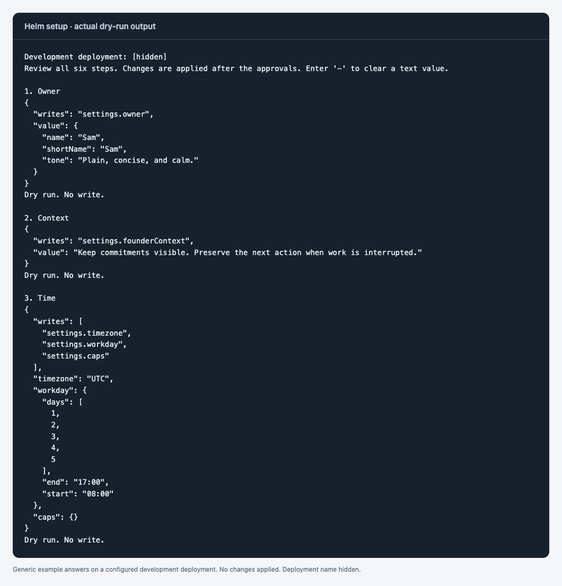
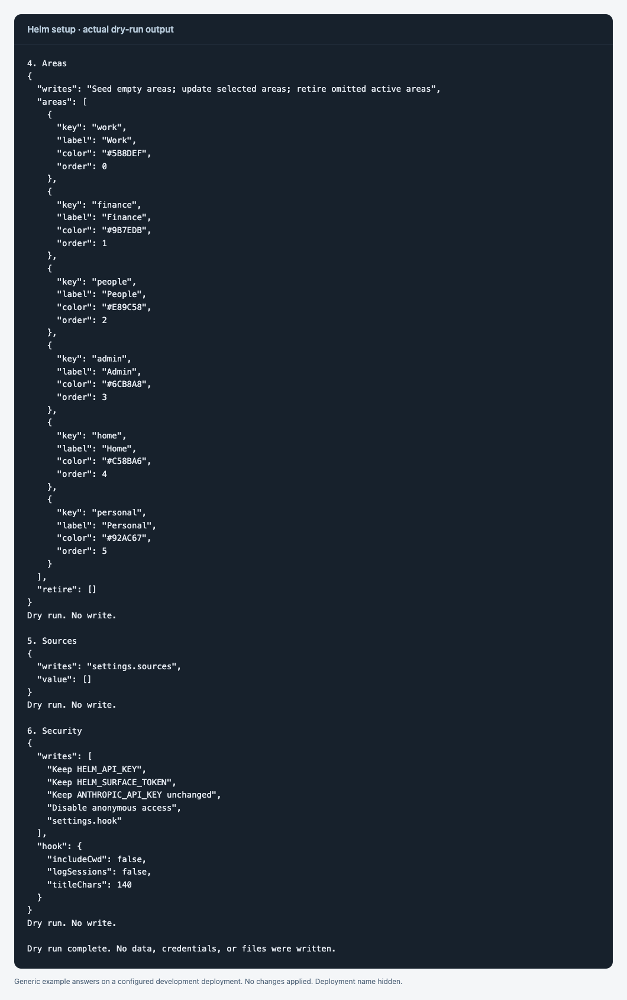

# Install Helm

Helm uses your own Convex project. No shared Helm service receives your tasks. A first installation uses a cloud development deployment. Production is a separate, later step.

## Prerequisites

Use macOS, Linux, or WSL. Install Node.js 20 or later. Use Node.js 22 or later to include the regression suite's live WebSocket check. Install Git. Create a Convex account. Install Claude Code. Sign in to Claude Code before testing a conversational brief.

Read [the security model](security.md). Keep this clone after installation; the MCP server and optional hook run files from it. If the GitHub repository is still private, authenticate Git with an account that can read it.

Check the tools:

```sh
node --version
git --version
claude --version
```

An Anthropic API key is optional. It enables the server-side AI actions. It is separate from Claude Code sign-in. Core tasks, briefs, the web interface, and configuration work without it.

## 1. Clone and install dependencies

Clone the repository into a new directory:

```sh
git clone https://github.com/AlexCunliffe/helm.git helm-oss
```

Enter the clone:

```sh
cd helm-oss
```

Install the application dependencies:

```sh
npm install
```

Install the MCP dependencies:

```sh
npm install --prefix mcp
```

## 2. Create a development deployment

Run the Convex setup:

```sh
npx convex dev --once
```

Sign in when the CLI asks. Select your own team. Select a new project. Name it `helm-oss`, or use another unused name. Select a cloud development deployment. Do not select an existing production project for this installation test.

Wait for the functions-ready message. The command generates bindings and writes `.env.local`. The deployment value must begin with `dev:`. The client URL must use the matching deployment's `convex.cloud` host. The site URL uses the corresponding `convex.site` host. Regional hostnames are valid. Keep the generated values; do not replace them with the placeholders in `.env.local.example`.

If the CLI selected a local deployment, repeat its configuration and choose cloud development:

```sh
npx convex dev --once --configure
```

The repository's setup and test helpers deliberately reject production and local Convex deployment targets.

## 3. Configure Helm

Run the wizard:

```sh
npm run setup
```

Answer the six steps. Review each summary. Enter `y` to approve a step. Enter `n` to keep that section unchanged. Enter `-` to clear an optional text answer.

| Step | Choose |
| --- | --- |
| Owner | Name, short name, optional role and business, and tone |
| Context | A short account of your week and what tends to slip |
| Time | Timezone, workday, working days, and optional limits |
| Areas | Keep, rename, remove, or add categories |
| Sources | Enable only connected sources; use their exact MCP server names |
| Security | Create missing keys; optionally set the Anthropic key; choose session logging |

For the first run, keep sources disabled until their connectors are ready. Keep session logging off unless you want it. Approve Security to create the missing API key and surface token. Each is a distinct 48-character random value. The wizard sets them in Convex. It prints neither value. It does not write a secret file.

The wizard collects all approvals before applying changes. It validates the proposed configuration first. If a connection fails during application, some approved sections may already be saved. Restore the connection. Run the wizard again. Existing keys and area IDs are preserved.





The previews show generic example answers on an already configured development deployment. Existing keys are kept. The deployment name is hidden. Use [the configuration guide](configure.md) for saved answers and dry-run.

## 4. Connect Claude Code

Preview the installation:

```sh
npm run install:claude -- --dry-run
```

Review the files. Run the installer:

```sh
npm run install:claude
```

Approve each file separately. The installer shows a diff and a backup path before writing. JSON string values are hidden in diffs. The MCP command and hook snippet show their non-secret details. A missing file gets an absence record so uninstall can remove it later.

The installer registers the `helm` MCP server. It installs `/helm-brief`, `/helm-capture`, `/helm-sweep`, and `/helm-reconcile` in your global skill directory. It preserves an existing unprefixed `/brief` skill. It offers an ambient-capture rule and two scheduled-task templates. It adds the SessionEnd hook only when session logging is enabled.

Schedule the templates in Claude Code if you want recurring runs. Installing the files does not create a scheduled job. Sweeps use your own connectors and Claude plan.

The installer normally uses `~/.claude.json` and `~/.claude/`. If `CLAUDE_CONFIG_DIR` is set, it uses that directory, including its `.claude.json`. The directory must be inside the selected home. Symlinked config paths are rejected. The clone's ignored `.helm-local` directory holds uninstall records.

Use `--yes` only after reviewing the proposed files. It approves every proposed global write. This flag does not change Convex data.

## 5. Check the installation

Run the development regression suite:

```sh
npm test
```

Wait for the backend checks and both hook suites to pass. Tests create temporary development fixtures and remove them. Each run uses its own task namespace and dates checked to be empty. Check-in cleanup requires a matching fixture owner and exact snapshots of rows created by that run. It refuses later changes. Tests also temporarily change development settings and authentication variables, then restore them. Stop other clients during the suite. Use a separate development project if other people depend on the deployment. With no Anthropic key, the suite checks missing-key behavior and skips live AI assertions. Node.js 20 skips the live WebSocket assertion.

Run the MCP contract checks:

```sh
npm run test:mcp
```

Check installed files:

```sh
npm run skills:check
```

A non-zero drift result means a desired file is absent or differs. A declined optional template also produces drift. Review the result before reinstalling. Preserve edits made by other tools or people.

Restart Claude Code. Open it in this clone. Type `/brief`. The repository skill uses the registered Helm MCP server. Outside the clone, type `/helm-brief`. If Claude cannot find the MCP server, restart it after registration. If it reports a rejected key, review the development selection and refresh the approved registration.

## 6. Open the web interface

Open the `CONVEX_SITE_URL` from `.env.local` with `/glass` appended. Read the API key in your own terminal:

```sh
npx convex env get HELM_API_KEY
```

Paste that value into the page's unlock field. Keep it out of chat and issue reports. The browser remembers it in localStorage. Open Settings to edit the same configuration used by MCP. Clear the site's browser data to remove the remembered key.

## Update or uninstall Claude integration

Run the installer again after moving the clone, changing its integration files, or rotating credentials. If an installed file has later edits, the installer stops on that file. Reconcile those edits with the recorded backup before updating it.

Preview uninstall:

```sh
npm run uninstall:claude -- --dry-run
```

Run uninstall:

```sh
npm run uninstall:claude
```

Approve each restoration. Uninstall restores original files or removes files created by Helm. It keeps backups and refuses to overwrite later edits. It does not delete Convex data. It does not remove schedules that you created separately in Claude Code. Remove those schedules separately.

Keep `.helm-local` until uninstall is complete. Review retained backups before deleting the clone. Backups can contain credentials.
